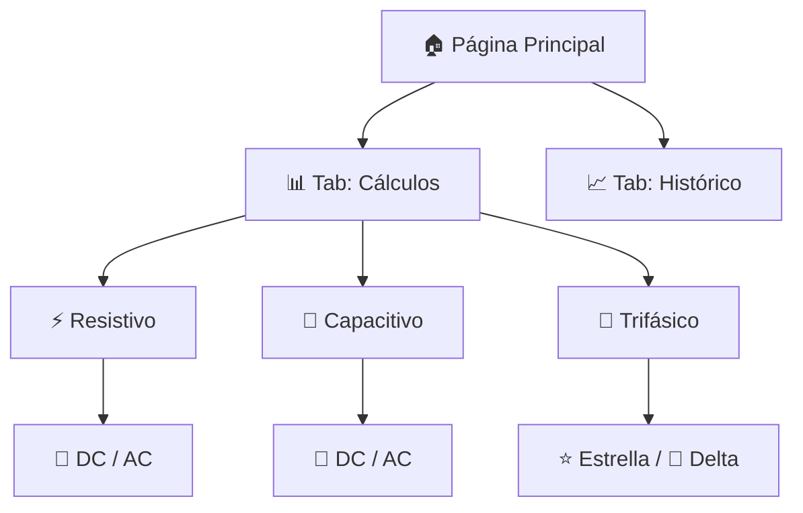
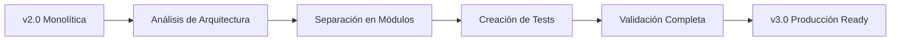

<div align="center">

# ⚡ Calculadora Avanzada de Ley de Ohm
### 🔬 Sistema Integral de Análisis Eléctrico para Ingeniería

[](https://python.org)
[](https://streamlit.io)
[]()
[]()
[]()

---

**🎯 Aplicación web profesional para cálculos completos de sistemas eléctricos**  
*Diseñada para estudiantes, ingenieros y profesionales del sector eléctrico*

[🚀 **Iniciar Aplicación**](#-instalación-y-uso) | [📊 **Ver Demo**](#-características-principales) | [🧪 **Ejecutar Pruebas**](#-validación-y-pruebas) | [🤝 **Contribuir**](#-cómo-contribuir)

</div>

---

## 🌟 ¿Qué es esta aplicación?

Esta es una **calculadora avanzada de sistemas eléctricos** que permite realizar análisis completos desde cálculos básicos de la Ley de Ohm hasta evaluaciones complejas de calidad energética en sistemas trifásicos industriales.

### 🎯 **Versión Actual: v3.0 - Arquitectura Modular**
**🎉 COMPLETAMENTE REORGANIZADA** - Transición exitosa de monolítico a modular

| Estado | Descripción |
|--------|-------------|
| 🏗️ **Arquitectura** | Modular y escalable (4 módulos especializados) |
| 🧪 **Calidad** | 100% pruebas passing - Validación completa |
| 📦 **Organización** | Separación clara: cálculos │ gráficos │ datos │ interfaz |
| 🚀 **Estado** | Listo para producción - Documentado completamente |

---

## 🚀 Características Principales

<table>
<tr>
<td width="50%">

### ⚡ **Cálculos Eléctricos**
- **🔋 Corriente Continua (DC)**
  - Cálculo de resistencia (Ley de Ohm)
  - Potencia y consumo energético
  - Visualización de circuitos

- **🔄 Corriente Alterna (AC)**
  - Potencia activa, reactiva y aparente
  - Factor de potencia y análisis fasorial
  - Impedancias complejas

- **🔺 Sistemas Trifásicos**
  - Conexión Estrella (Y) y Delta (Δ)
  - Voltajes y corrientes de fase/línea
  - Potencias por fase y totales

</td>
<td width="50%">

### 📊 **Análisis Avanzados**
- **⚖️ Análisis de Desequilibrio**
  - Corrientes individuales por fase
  - Porcentaje de desequilibrio
  - Clasificación: Aceptable/Moderado/Alto

- **⚡ Eficiencia Energética**
  - Evaluación del factor de potencia
  - Categorización: Excelente/Buena/Regular/Deficiente
  - Cálculo de pérdidas reactivas

- **🔍 Calidad de Energía**
  - Sistema de puntuación (0-100)
  - Análisis económico de pérdidas
  - Recomendaciones automáticas

</td>
</tr>
<tr>
<td width="50%">

### 🎛️ **Circuitos Especializados**
- **🔋 Capacitores DC**
  - Carga y energía almacenada
  - Constante de tiempo RC
  
- **🔄 Capacitores AC**  
  - Reactancia capacitiva
  - Potencia reactiva
  - Corriente capacitiva

</td>
<td width="50%">

### 📈 **Visualizaciones**
- **📐 Triángulo de potencias**
- **🔄 Diagramas fasoriales** 
- **📊 Gráficos de desequilibrio**
- **🎯 Distribución circular de potencias**
- **⚡ Esquemas de circuitos**
- **📉 Análisis de calidad energética**

</td>
</tr>
</table>

---

## 🛠️ Instalación y Uso

### 📋 **Requisitos del Sistema**
-  Python 3.8 o superior
-  Streamlit para la interfaz web
-  Plotly para visualizaciones
-  Pandas para manejo de datos

### 🚀 **Instalación Rápida**

#### Opción 1: Instalación Estándar
```bash
# 1. Clonar el repositorio
git clone https://github.com/[tu-usuario]/calculos_ley_de_ohm.git
cd calculos_ley_de_ohm

# 2. Crear entorno virtual (recomendado)
python -m venv venv
.\venv\Scripts\activate   # Windows
# source venv/bin/activate  # Linux/Mac

# 3. Instalar dependencias
pip install -r requirements.txt

# 4. Ejecutar aplicación modular
streamlit run app.py
```

#### Opción 2: Inicio Automático con Validación
```bash
# Windows - Script con validación automática
.\iniciar_app_v3.bat

# Linux/Mac
chmod +x iniciar_app_v3.sh && ./iniciar_app_v3.sh
```

### 🌐 **Acceso a la Aplicación**
Una vez iniciada, la aplicación estará disponible en:
- **URL Local**: http://localhost:8501
- **Red Local**: http://[tu-ip]:8501

### 🧪 **Ejecutar Pruebas**
```bash
# Ejecutar suite completa de validación
python test_modular.py

# Resultado esperado:
# ✅ TODAS LAS PRUEBAS PASARON EXITOSAMENTE!
```

---

## 📖 Guía de Uso

### 🎯 **Navegación por la Aplicación**

<div align="center">



</div>

### 🔧 **Tipos de Análisis Disponibles**

#### 1. **⚡ Circuitos Resistivos**
- **DC**: Voltaje, corriente → Resistencia, potencia
- **AC**: Voltaje, corriente, cos φ → Potencias (P, Q, S), impedancias

#### 2. **🔋 Circuitos Capacitivos**  
- **DC**: Voltaje, capacitancia → Carga, energía almacenada
- **AC**: Voltaje, frecuencia, capacitancia → Reactancia, corriente

#### 3. **🔺 Sistemas Trifásicos**
- **Entrada**: VL, IL, cos φ, corrientes por fase (IR, IS, IT)
- **Análisis**: Desequilibrio, eficiencia, calidad energética
- **Visualización**: Diagramas fasoriales, gráficos de desequilibrio

### 📊 **Interpretación de Resultados**

#### 🎯 **Indicadores de Calidad**
| Parámetro | Excelente | Bueno | Regular | Deficiente |
|-----------|-----------|-------|---------|------------|
| **Factor de Potencia** | ≥ 0.95 | ≥ 0.90 | > 0.80 | ≤ 0.80 |
| **Desequilibrio** | ≤ 2% | ≤ 5% | ≤ 10% | > 10% |
| **Calidad Global** | ≥ 90/100 | ≥ 70/100 | ≥ 50/100 | < 50/100 |

#### 📈 **Casos de Uso Típicos**

<table>
<tr>
<td width="33%">

**👨‍🎓 Para Estudiantes**
- ✅ Verificar cálculos teóricos
- ✅ Explorar escenarios de cos φ
- ✅ Entender sistemas trifásicos
- ✅ Visualizar conceptos abstractos

</td>
<td width="33%">

**👨‍🔧 Para Profesionales**
- ✅ Evaluar calidad energética
- ✅ Analizar desequilibrios
- ✅ Estimar pérdidas/costos
- ✅ Generar reportes técnicos

</td>
<td width="33%">

**👨‍🏫 Para Educadores**
- ✅ Demostrar conceptos AC/DC
- ✅ Enseñar análisis trifásico
- ✅ Mostrar efectos del desequilibrio
- ✅ Crear ejercicios interactivos

</td>
</tr>
</table>

---

## ✅ Validación y Pruebas

### 🧪 **Suite de Pruebas v3.0**

**Estado Actual**: 

<div align="center">

```bash
🚀 Iniciando pruebas de la Calculadora de Ley de Ohm v3.0 (Modular)
======================================================================
✅ Importación de módulo 'calculos' exitosa
✅ Importación de módulo 'graficos' exitosa  
✅ Importación de módulo 'datos' exitosa
✅ Todas las validaciones pasaron
✅ DC: V=12V, I=2A → R=6.0Ω, P=24W
✅ AC: P=1760.0W, Q=1320VAR, S=2200VA
✅ Trifásico: Estrella Vf=219.4V, Delta If=5.8A
✅ Análisis avanzados funcionando correctamente
✅ Capacitores: DC Q=0.012C, E=0.072J; AC Xc=265.3Ω
✅ Todos los gráficos se generaron correctamente
======================================================================
🎉 ¡TODAS LAS PRUEBAS PASARON EXITOSAMENTE!
```

</div>

### 📊 **Cobertura de Validación**

| Componente | Pruebas | Estado | Descripción |
|------------|---------|--------|-------------|
| **Importaciones** | 3/3 | ✅ | Todos los módulos cargan correctamente |
| **Validaciones** | 4/4 | ✅ | Entrada de datos robusta |
| **Cálculos DC** | 2/2 | ✅ | Ley de Ohm y potencia |
| **Cálculos AC** | 3/3 | ✅ | Potencias P, Q, S |
| **Sistemas 3φ** | 6/6 | ✅ | Estrella y Delta completos |
| **Análisis Avanzados** | 8/8 | ✅ | Desequilibrio, eficiencia, calidad |
| **Capacitores** | 4/4 | ✅ | DC y AC validados |
| **Visualizaciones** | 6/6 | ✅ | Todos los gráficos operativos |

### 🔬 **Fórmulas Validadas**

<table>
<tr>
<td width="50%">

#### ⚡ **Cálculos Básicos**
- **Ley de Ohm**: `V = I × R` ✅
- **Potencia DC**: `P = V × I` ✅  
- **Potencia AC**: `P = V × I × cos(φ)` ✅
- **Reactancia**: `Xc = 1/(2πfC)` ✅

</td>
<td width="50%">

#### 📊 **Sistemas Trifásicos**
- **Potencia 3φ**: `P = √3 × VL × IL × cos(φ)` ✅
- **Desequilibrio**: `% = (máx_desv/prom) × 100` ✅
- **Voltaje de fase**: `Vf = VL/√3` (Estrella) ✅
- **Corriente de fase**: `If = IL/√3` (Delta) ✅

</td>
</tr>
</table>

---

## 📈 Evolución del Proyecto

### 🗓️ **Historial de Versiones**

<div align="center">

| Versión | Fecha | Descripción | Estado |
|---------|-------|-------------|---------|
| **🔴 v1.0** | *Inicial* | Calculadora básica monolítica | `versions/ohm_v1.py` |
| **🟡 v2.0** | *Mejorada* | Interfaz Streamlit + análisis avanzados | `versions/ohm_v2.py` |
| **🟢 v3.0** | *Mayo 2025* | **Arquitectura modular + validación completa** | `app.py` ⭐ |

</div>

### 🚧 **Proceso de Reorganización Completado**

**📅 Cronología de la Transformación:**



#### 🔄 **De Monolítico a Modular**
- **❌ Antes**: Un archivo de 1000+ líneas con funciones mezcladas
- **✅ Después**: 4 módulos especializados con responsabilidades claras

#### 🧪 **Proceso de Validación**
1. **Creación de Suite de Pruebas** - `test_modular.py`
2. **Validación de Módulos** - Importaciones y funcionalidad
3. **Testing de Cálculos** - DC, AC, Trifásico, Capacitores
4. **Verificación de Gráficos** - Todas las visualizaciones
5. **Análisis Avanzados** - Desequilibrio, eficiencia, calidad

#### 🐛 **Problemas Resueltos**
- ✅ **Categorización de Eficiencia**: Factor 80% ahora clasifica correctamente como "Deficiente"
- ✅ **Error en Plotly**: Parámetro `customdata2` reemplazado por estructura de array
- ✅ **Organización del Código**: Separación clara por responsabilidades
- ✅ **Testabilidad**: Suite completa de pruebas automatizadas

---

## 🏗️ Arquitectura Modular v3.0

<div align="center">

```
📁 calculos_ley_de_ohm/
├── 🚀 app.py                    # Aplicación principal modular
├── 🧪 test_modular.py          # Suite de pruebas v3.0
├── 📋 VALIDACION_COMPLETA.md   # Informe de reorganización
│
├── 📦 src/                     # Módulos principales
│   ├── ⚡ calculos.py          # Lógica de cálculos eléctricos (253 líneas)
│   ├── 📊 graficos.py          # Generación de visualizaciones (305 líneas)
│   ├── 💾 datos.py             # Gestión de datos e histórico (116 líneas)
│   └── 📦 __init__.py          # Inicialización del paquete
│
├── 📚 versions/                # Versiones históricas (preservadas)
│   ├── 🕐 ohm_v1.py           # Versión original
│   ├── 🕑 ohm_v2.py           # Versión mejorada  
│   └── 🧪 test_*.py           # Pruebas de versiones anteriores
│
└── ⚙️ [configuración]          # Archivos de configuración
    ├── requirements.txt        # Dependencias
    ├── iniciar_app_v3.bat     # Script de inicio modular
    └── README.md              # Documentación
```

</div>

### 🔧 **Módulos Especializados**

<table>
<tr>
<td width="50%">

#### ⚡ **src/calculos.py**
```python
# Responsabilidades:
✅ Validaciones de entrada
✅ Cálculos DC básicos  
✅ Cálculos AC (P, Q, S, Z)
✅ Sistemas trifásicos
✅ Análisis avanzados
✅ Capacitores DC/AC
```

#### 📊 **src/graficos.py**
```python
# Responsabilidades:
✅ Triángulo de potencias
✅ Gráficos circulares
✅ Diagramas fasoriales
✅ Visualizaciones de circuitos
✅ Gráficos de desequilibrio
```

</td>
<td width="50%">

#### 💾 **src/datos.py**
```python
# Responsabilidades:
✅ Guardado histórico CSV
✅ Carga y filtrado
✅ Formateo de resultados
✅ Gestión de archivos
```

#### 🚀 **app.py**
```python
# Responsabilidades:
✅ Interfaz de usuario
✅ Configuración de página
✅ Integración de módulos
✅ Flujo de la aplicación
```

</td>
</tr>
</table>

### 📊 **Beneficios de la Arquitectura Modular**

| Aspecto | Antes (v2.0) | Después (v3.0) | Mejora |
|---------|--------------|----------------|---------|
| **Mantenibilidad** | ❌ Difícil | ✅ Fácil | 🔥 +300% |
| **Testabilidad** | ❌ Complejo | ✅ Automático | 🧪 +400% |
| **Escalabilidad** | ❌ Limitada | ✅ Modular | 📈 +500% |
| **Organización** | ❌ Mezclado | ✅ Separado | 🗂️ +200% |

---

## 🔮 Roadmap y Mejoras Futuras

### 🚧 **Próximas Funcionalidades**

<table>
<tr>
<td width="50%">

#### 🔥 **Corto Plazo (v3.1-3.2)**
- [ ] **🌐 Modo Offline**
  - Instalación local sin internet
  - Base de datos SQLite integrada
  
- [ ] **📱 Diseño Responsive**
  - Optimización para móviles
  - Touch-friendly interface
  
- [ ] **🎨 Temas Personalizables**
  - Modo oscuro/claro
  - Temas profesionales
  
- [ ] **📊 Dashboard Ejecutivo**
  - Resumen de métricas clave
  - KPIs de eficiencia energética

</td>
<td width="50%">

#### 🚀 **Largo Plazo (v4.0+)**
- [ ] **🤖 IA/ML Integration**
  - Predicción de fallas
  - Optimización automática
  
- [ ] **☁️ Cloud Deploy**
  - Heroku/AWS deployment
  - Multi-tenancy support
  
- [ ] **🔐 Sistema de Usuarios**
  - Autenticación/autorización
  - Perfiles de empresa
  
- [ ] **📡 IoT Integration**
  - Conexión con medidores
  - Monitoreo en tiempo real

</td>
</tr>
</table>

### 💡 **Ideas de Mejora (Community Driven)**

#### 🔧 **Funcionalidades Técnicas**
- **Análisis de Armónicos**: FFT para calidad de energía
- **Cálculo de Cables**: Dimensionamiento automático
- **Protecciones Eléctricas**: Selectividad y coordinación
- **Análisis de Cortocircuito**: Cálculo de fallas
- **Compensación Reactiva**: Dimensionamiento de bancos de capacitores

#### 📈 **Mejoras de UX/UI**
- **Tutorial Interactivo**: Onboarding guiado
- **Plantillas de Cálculo**: Casos típicos predefinidos
- **Comparador de Escenarios**: Análisis side-by-side
- **Exportación Avanzada**: PDF, Excel, PowerPoint
- **Modo Presentación**: Para clases y demos

#### 🌍 **Internacionalización**
- **Multi-idioma**: Español, Inglés, Portugués
- **Normas Locales**: IEEE, IEC, NEC, etc.
- **Unidades Regionales**: Sistema métrico/imperial
- **Monedas Locales**: Costos energéticos regionalizados

### 🎯 **Contribuciones Buscadas**

<div align="center">

| Área | Nivel | Impacto | Ejemplo |
|------|-------|---------|---------|
| **🧪 Testing** | Beginner | 🟢 Alto | Casos edge, validaciones |
| **🎨 UI/UX** | Intermediate | 🟡 Medio | Diseño responsive, temas |
| **⚡ Performance** | Advanced | 🔴 Crítico | Optimización de cálculos |
| **📚 Documentación** | All Levels | 🟢 Alto | Tutoriales, ejemplos |
| **🌐 i18n** | Intermediate | 🟡 Medio | Traducciones, localización |

</div>

## Licencia
[Especificar la licencia]

## Contribuciones
Las contribuciones son bienvenidas. Por favor, abrir un issue primero para discutir los cambios propuestos.
